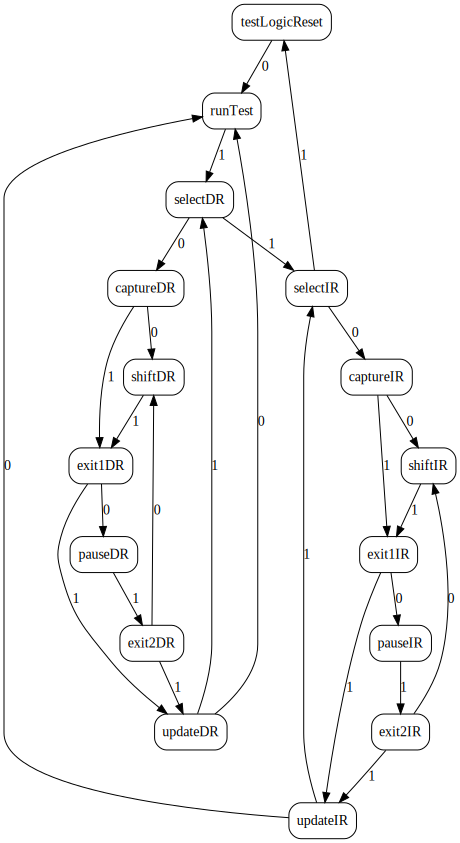

JTAG FSM

```bash
iverilog -o sim jtag.v tb.v && vvp sim
```

https://vc.drom.io/?github=wavedrom/vcd-samples/trunk/examples/jtag/jtag.vcd&github=wavedrom/vcd-samples/trunk/examples/jtag/jtag.waveql


