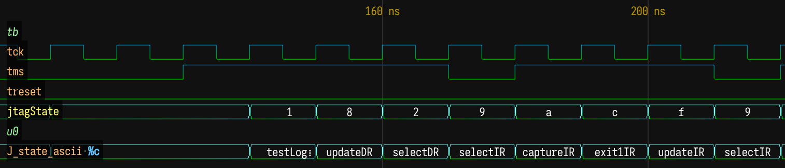

JTAG FSM

```bash
iverilog -o sim jtag.v tb.v && vvp sim
```

https://wavedrom.live/?github=wavedrom/vcd-samples/trunk/examples/jtag/jtag.vcd&github=wavedrom/vcd-samples/trunk/examples/jtag/jtag.waveql

One way of putting string into waveforms is to encode them as a vector of characters, and then use WaveQL `%c` format to decode them.




